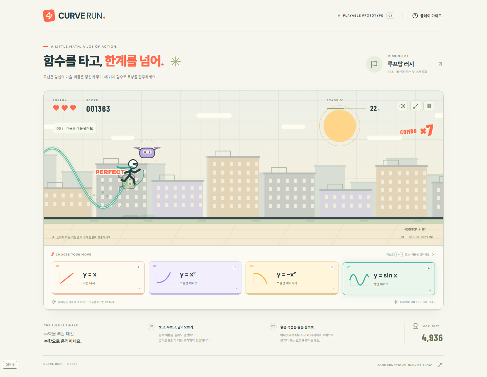

# Super Function Hero

**수학 함수 그래프가 캐릭터의 액션 기술이 되는 2D 횡스크롤 웹게임.**

문제를 풀고 정답을 고르는 대신, 함수를 누르면 캐릭터가 그 곡선을 따라 움직이며 적을 공격하고 장애물을 피합니다. 목표는 네 가지 기술의 입력 반응성, 궤적, 타격감, 콤보가 실제로 재미있는지 확인하는 작은 MVP입니다.

현재 플레이 화면에는 첫 프로토타입의 임시 이름 **CURVE RUN**이 표시됩니다. 프로젝트 이름은 **Super Function Hero**입니다.



## 바로 실행

### 설치 없이

[`artifacts/PLAY-SUPER-FUNCTION-HERO.html`](artifacts/PLAY-SUPER-FUNCTION-HERO.html)을 내려받아 브라우저에서 엽니다. GitHub의 파일 화면에서 **Download raw file**로 저장하세요. GitHub의 코드 보기 화면 자체는 게임을 실행하지 않습니다.

게임은 클라이언트에서 실행됩니다. 효과음은 시작 버튼을 누른 뒤 활성화됩니다. 외부 Google Fonts가 로드되지 않아도 기본 폰트로 플레이할 수 있습니다.

### 개발 서버

Node.js 22.12+ 또는 24:

```sh
git clone https://github.com/CauchyRiemannEquations/super-function-hero.git
cd super-function-hero
npm ci
npm run dev
```

터미널에 표시된 주소를 브라우저에서 엽니다. 기본 주소는 `http://localhost:5173/`입니다. 같은 Wi-Fi의 휴대폰에서는 Network 주소를 사용할 수 있습니다.

```sh
npm test                 # 궤적·충돌 테스트
npm run build            # 프로덕션 빌드
npm run preview          # 프로덕션 미리보기
npm run standalone       # artifacts/의 단일 HTML 재생성
```

## 네 가지 액션

| 키 / 터치 버튼 | 함수 | 움직임 |
|---|---|---|
| 1 | `y = x` | 직선 대시 · 앞의 적 관통 |
| 2 | `y = x²` | 포물선 어퍼컷 · 공중으로 치솟기 |
| 3 | `y = −x²` | 포물선 내려찍기 · 공중에서 낙하, 지상에서는 도약 후 낙하 |
| 4 | `y = sin x` | 1.5주기 물결 이동 · 높이가 다른 적 연속 타격 |

자동 달리기, HP 3칸, 38초 미션 하나를 구현했습니다. Enter로 시작, Space/Esc로 일시정지, R로 즉시 재시작합니다. 공중에서 다른 기술로 연결할 수 있습니다. 적이 실제 궤적과 공격 범위에 닿는지로 판정하며 정답 함수 검사는 없습니다.

그래프 잔상, 화면 흔들림, hit stop, knockback, 파티클, 효과음, 콤보 확대, PERFECT, WAVE HIT, PARABOLA COMBO가 적용되어 있습니다. 로그인·서버·랭킹·상점은 없습니다.

## 현재 검증 결과

- 궤적·충돌 테스트 **4개**, 브라우저 시나리오 **21개** 통과.
- 실제 키 입력, 무적 없이 HP 3칸을 유지하며 클리어: **타격 18회 / 최대 17콤보 / PERFECT 12회 / 4,936점**.
- 네 함수의 다른 움직임, 웨이브 다중 타격, 상승→하강 연계, 충돌·실패·재시작 확인.
- 390px 모바일 터치와 버튼 범위, 320px 가로 넘침 확인.
- 최종 콘솔 오류·경고 없음. 단일 HTML 직접 실행과 배포본의 개발 도구 제거 확인.

모바일은 Chromium 터치 에뮬레이션으로 확인했습니다. 실제 iOS/Android 기기의 성능·오디오·가로 화면 손맛은 아직 검증하지 않았습니다. 수치 검증은 재미 검증을 대체하지 않으며, 플레이어 관찰이 다음 단계입니다.

## 최근 플레이 피드백과 다음 방향

> “재밌는데 모바일 가로 환경으로… 저 직선 무브 버튼을 인게임 내에 넣으면 좋을 듯?”

다음 UX 실험은 **모바일 가로 플레이**와 **게임 화면 안의 액션 버튼**입니다. 먼저 직선 대시 버튼을 어디에 넣을지, 나머지 세 버튼을 함께 배치할지 논의하려고 합니다. 현재 버전은 화면 아래에 네 버튼을 두는 초기 MVP이며, 이 제안은 아직 구현하지 않았습니다.

## GPT와 이어서 이야기할 자료

- [CHATGPT_BRIEF.md](docs/CHATGPT_BRIEF.md): 현재 상태와 다음 논의 사항을 한 번에 읽는 요약, 복사해서 사용할 질문.
- [GAME_DESIGN.md](docs/GAME_DESIGN.md): 원래 기획의 핵심 요구사항과 14개 범위.
- [NEXT_STEPS.md](docs/NEXT_STEPS.md): 모바일 가로 환경·인게임 버튼 제안과 검증 기준.
- [IMPLEMENTATION.md](docs/IMPLEMENTATION.md): 실행, 수치, 파일 구조, 개발 도구와 구현 설명.
- [verification.json](docs/verification.json): 검증 결과 요약.
- [데스크톱 클리어 화면](docs/images/desktop-clear.png), [모바일 초기 화면](docs/images/mobile-ready.png).

## 코드 구조

```text
src/App.tsx               HUD, 스킬 버튼, 가이드, 결과, 개발 도구
src/style.css             반응형 화면 스타일
src/game/engine.ts        게임 상태, 120Hz 업데이트, 충돌, 카메라, 렌더링
src/game/trajectory.ts    정규화한 함수 이동, 구간 충돌 거리
src/game/stage.ts         미션의 구간과 적·장애물 배치
src/game/audio.ts         Web Audio 효과음
src/game/trajectory.test.ts
scripts/standalone.mjs    설치 없는 HTML 생성
artifacts/                단일 HTML 실행본
docs/                     기획, 논의 요약, 검증과 캡처
```

React + TypeScript + Vite + HTML Canvas를 사용합니다. 게임 좌표는 React UI 상태 갱신과 분리되어 있고, `requestAnimationFrame` 및 고정 시간 스텝으로 이동합니다.
