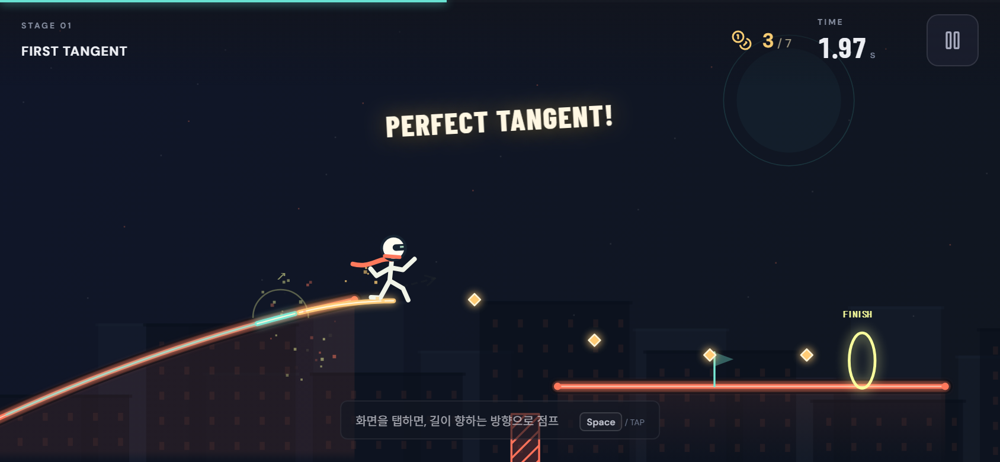
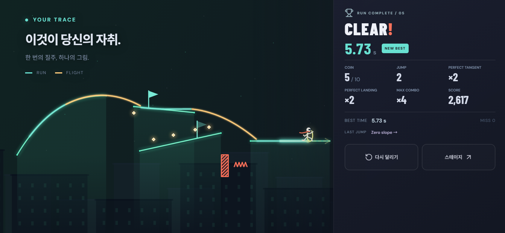

# Super Function Hero · Tangent Parkour

**그래프를 달리고, 탭 타이밍으로 날아가는 모바일 가로 파쿠르 게임.**

졸라맨은 함수 그래프 위를 자동으로 달립니다. 화면을 탭하면 현재 위치의 **접선 방향**으로 발사되고, 중력을 받으며 다른 그래프나 플랫폼에 착지합니다. 같은 길에서도 어디서 뛰는지에 따라 경로가 달라집니다. 지나온 밝은 자취가 당신의 플레이를 하나의 그림으로 남깁니다.



기존 `CauchyRiemannEquations/super-function-hero`의 React·TypeScript·Vite·Canvas 프로젝트를 리팩터링했습니다. 네 함수 기술 선택 버튼과 CORE/Gate 전투 코스를 접선 점프 중심으로 교체했습니다. 함수 이름을 고르거나 수학 퀴즈를 맞힐 필요가 없습니다.

## 플레이

메인 화면 **Play → Stage Select → Stage 1–5 → Result**.

- **자동 달리기:** 그래프 모양이 실제 지형입니다. 몸도 길의 경사에 맞춰 기울어집니다.
- **탭해서 점프:** 현재 지점의 접선이 짧게 번쩍이고 그 방향으로 발사됩니다. 공중에서 다시 누르는 것은 이중 점프가 아닙니다.
- **착지:** 다른 길에 내려앉으면 다시 자동으로 달립니다. 작은 착지 오차를 허용합니다.
- **수집과 위험:** 코인을 모으고 가시·벽·낭떠러지를 피하세요. 코인을 전부 모아야 클리어되는 것은 아닙니다.
- **체크포인트:** 도달한 체크포인트에서 이어 달립니다. 실패는 0.5초의 `MISS!` 후 재개되며 기록에 1초 페널티가 붙습니다. 체크포인트 이후 얻은 코인·점수를 되돌리고 실패 구간의 자취를 지웁니다. 시작점부터 저장된 경로는 보존합니다.
- **Perfect Tangent:** 좋은 발사 타이밍과 착지를 잡으면 강조된 자취·효과·보너스를 받습니다.
- **결과:** `YOUR TRACE`에서 전체 경로를 보고 시간, 코인, 점프, Perfect 착지, 최대 콤보를 비교하세요. 스테이지마다 Best Time과 최고 점수가 이 브라우저에 저장됩니다.

| 조작 | 동작 |
| --- | --- |
| 플레이 화면 탭 / 마우스 클릭 | 접선 점프 |
| Space / ↑ | 접선 점프 |
| P / Esc | 일시정지·계속 |
| R | 현재 스테이지 처음부터 재도전 |
| 화면의 일시정지 버튼 | 일시정지 메뉴 |

모바일은 **가로 화면**이 기준입니다. 세로에서는 휴대폰을 가로로 돌리라는 안내를 제공합니다. 화면 전체가 점프 입력 영역이며 플레이 중 함수 선택 버튼은 없습니다. 음소거·전체 화면·모션 설정은 메뉴에서 조절합니다. 네이티브 fullscreen이나 방향 잠금이 지원되지 않거나 거절되어도 브라우저 화면에서 플레이할 수 있습니다.

## 다섯 코스

| Stage | 이름 | 플레이 경험 |
| --- | --- | --- |
| 1 | FIRST TANGENT | 완만한 포물선에서 뛰어 첫 플랫폼에 착지. 접선 가이드 항상 표시 |
| 2 | ZERO SLOPE | 포물선 꼭대기 근처에서 거의 수평으로 발사 |
| 3 | GO HIGH | 가파른 부분을 이용해 높은 플랫폼에 도달 |
| 4 | NEGATIVE | 음의 기울기로 낮은 길에 진입하고 다시 뛰기. 가이드는 짧게 표시 |
| 5 | CURVE RUN | 삼차 곡선과 움직이는 상부 플랫폼. 높은 지름길과 아래 코인 루트 선택 |

길이 위로 향하면 위로, 평평하면 옆으로, 아래로 향하면 아래로 날아갑니다. 플레이 중 긴 수학 설명 없이 그래프를 보며 점프 위치를 익히도록 구성했습니다.

## 물리와 데이터

함수는 다항식 계수·원점·배율·높이 오프셋으로 정의합니다. 그래프 렌더링과 접선 계산은 같은 평가기를 사용합니다. 문자열 수식을 실행하는 `eval`은 사용하지 않습니다.

현재 지점의 기울기가 `m = f'(x)`이면 초기 속도는 정확히 접선 방향입니다.

```text
vx = speed / sqrt(1 + m²)
vy = m × vx
```

게임 좌표는 **y가 위쪽으로 증가**합니다. 비행 중에는 `vy -= gravity × dt`를 적용하고, Canvas에 그릴 때 y 방향을 뒤집습니다. 함수의 x/y 배율도 미분값에 반영하여 보이는 길의 기울기와 실제 발사 방향을 일치시킵니다. 별도의 숨은 수직 점프 속도를 더하지 않습니다.

120Hz 고정 스텝, 이동 구간 충돌과 착지 보정으로 빠른 발사를 처리합니다. 접선 방향은 시작 속도를 결정하며, 이후의 공중 자취는 중력 때문에 휘어집니다. 지형을 따라 달릴 때의 자취와 공중 자취를 모두 기록하고, 클리어 후 카메라가 전체 경로를 보여줍니다.

`StageData`는 시작·목표, 그래프/플랫폼, 코인, 장애물, 체크포인트, Perfect 구간, 가이드 정책, 색과 범위를 정의합니다. 현재 수집 여부와 속도·점수는 실행 상태로 분리합니다. 새 코스는 데이터를 추가하는 방식으로 확장할 수 있습니다.

## 유지한 기존 기반

- 흰 헬멧과 스카프를 두른 졸라맨, 빠르고 과장된 팔다리 애니메이션.
- 밝은 중심선과 넓은 외곽으로 그린 이동 자취, 파티클·화면 흔들림·순간 효과.
- 옥상 스카이라인 세계관, 다층 시차 배경, Super Function Hero 제목과 favicon.
- 합성 Web Audio 효과음·음소거, safe-area·DPR·균일 화면 배율.
- 문서가 숨겨졌을 때 자동 일시정지, fullscreen·방향 잠금 실패 허용, 설치 없는 단일 HTML 배포.
- OS의 `prefers-reduced-motion` 기본값과 모션 감소 설정으로 불필요한 화면 흔들림·전환을 줄이는 접근성.

기존 버전에는 **BGM, PWA manifest/service worker, 별도 스플래시 기능이 없었습니다.** 효과음과 기존 브라우저 호환 기능을 유지했습니다. 단일 HTML 다운로드와 PWA 설치는 별개입니다. 이전 최고 점수 키 `curve-run-best`를 새 Best Time으로 해석하지 않으며, 접선 버전의 스테이지 기록은 별도 저장 키를 사용합니다. 저장 접근이 막힌 환경에서도 실행을 계속할 수 있고, 기록은 세션 안에서 유지됩니다.

## 실행과 배포

Node.js 22.12+ 또는 24에서:

```sh
git clone https://github.com/CauchyRiemannEquations/super-function-hero.git
cd super-function-hero
npm ci
npm run dev
```

```sh
npm test
npm run build
npm run preview
npm run standalone
```

`npm run standalone`은 빌드 결과와 favicon을 [`artifacts/PLAY-SUPER-FUNCTION-HERO.html`](artifacts/PLAY-SUPER-FUNCTION-HERO.html)에 인라인합니다. 이 파일을 다운로드해 브라우저에서 직접 열 수 있습니다. 효과음은 사용자의 시작·탭 입력 이후 활성화됩니다.

## 코드 구조

| 파일 | 책임 |
| --- | --- |
| `src/App.tsx`, `src/components/TitleScreen.tsx` | 메인·스테이지 선택·간결한 HUD·일시정지·설정·결과 |
| `src/game/engine.ts` | Canvas 게임 루프, 카메라, 캐릭터·접선·연출과 전체 자취 |
| `src/game/physics.ts` | 브라우저와 분리한 접선 발사·달리기·중력·착지·수집·체크포인트 시뮬레이션 |
| `src/game/stage.ts` | StageData와 직접 설계한 다섯 코스·검증용 입력 경로 |
| `src/game/trajectory.ts` | 다항식·해석적 미분, 접선 속도, 움직이는 지형 위치, 이동 구간 거리 |
| `src/game/input.ts` | 단일 점프 입력 버퍼와 만료·초기화 |
| `src/game/records.ts` | 스테이지별 Best Time·최고 점수·클리어 횟수와 설정 저장 |
| `src/game/viewport.ts`, `src/game/browser-mode.ts` | 화면 배율, 선택적 fullscreen·방향 잠금 |
| `src/game/audio.ts` | 사용자 입력으로 활성화되는 합성 효과음 |
| `scripts/standalone.mjs` | 설치 없이 열 수 있는 단일 HTML 생성 |

## 검증과 확장

단위 테스트 **39개**와 프로덕션 빌드가 통과했습니다. ±100ms 타이밍 변화, 30Hz/120Hz 실행 일치, 정확한 접선 속도, 움직이는 지형 착지, 입력 버퍼, 저장 실패, 체크포인트 100회 재시도를 검증합니다.

Chromium에서 실제 Space 입력과 터치 이벤트로 **다섯 스테이지와 Stage 5의 두 루트를 완주**했습니다. 터치 검증 17개 항목은 기록의 새로고침 후 유지, 844×390·740×360 결과 버튼/스크롤, 390×844 회전 자동 일시정지, 브라우저 정책으로 fullscreen을 거부한 상태의 플레이까지 포함합니다. [터치 검증 기록](docs/verification-tangent.json), [직접 플레이 검토](docs/PLAYTEST.md)를 확인할 수 있습니다. [단일 HTML 검증](docs/verification-standalone.json)은 원격 요청을 차단하고 `file://`에서 실제 입력으로 Stage 1을 완주했습니다.



브라우저 검증을 재현하려면 개발 서버를 켜고 `node scripts/browser-smoke.mjs`를 실행하세요. 별도로 설치된 Playwright/Chromium 또는 Codex의 번들 런타임을 사용합니다. 선택적으로 `SFH_URL`과 `SFH_PLAYWRIGHT_PATH`를 지정할 수 있습니다. 이전 v0.2의 검증 JSON·이미지는 이전 코스의 기록입니다.

[설정·오디오 회귀 검증](docs/verification-settings.json)은 실제 스위치 조작, 설정의 새로고침 유지, 오디오 활성화, 설정 창의 R/Esc 입력 차단을 확인합니다. 테스트 브라우저의 탭 전환은 `document.hidden`을 바꾸지 않아 네이티브 백그라운드 전환의 자동 일시정지는 미검증입니다.

실제 iOS/Android의 손가락 가림, 주소창·노치, 오디오 정책, 성능, 방향 잠금은 기기 검토가 필요합니다. 자동 클리어만으로 재미나 학습 효과를 확인했다고 판단하지 않습니다.

이번 범위는 다섯 코스의 vertical slice입니다. **보스전·움직이는 약점·적·추가 아이템·온라인 랭킹은 아직 구현하지 않았습니다.** 이후 보스는 페이즈별 지형·약점 위치/이동·가이드·장애물·점프 제한을 데이터로 조합하고, 접선 비행으로 약점에 닿는 플레이로 확장할 수 있습니다.

기존 코드 분석, 재사용 결정과 후속 구조는 [리디자인 기록](docs/TANGENT_REDESIGN.md)을 참고하세요.
