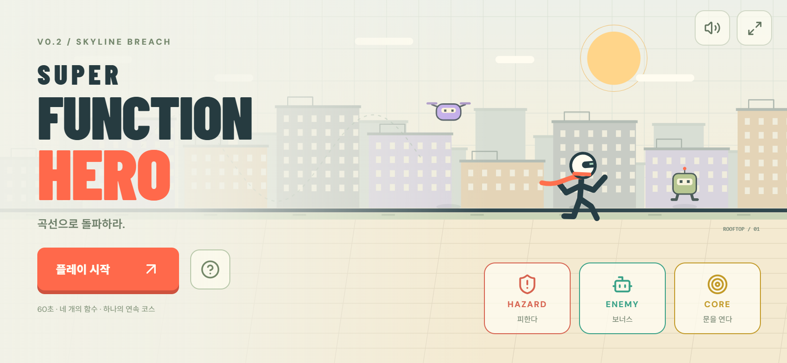

# Super Function Hero · v0.2

**함수 그래프가 이동과 공격이 되는 모바일 가로 액션게임.** 문제나 정답 선택 없이, 실제 곡선으로 돌파합니다.



## 이번 버전

- 타이틀·가이드·플레이·결과를 같은 모바일 가로 프레임 안에 배치했습니다. 이름은 Super Function Hero로 통일했습니다.
- 기존 네 기술, 80px 좌우 2+2 터치 HUD, 그래프 잔상, hit stop, 화면 흔들림, PERFECT·콤보를 유지합니다.
- **60초짜리 연속 코스**: 중간 메뉴 없이 잠금 해제 → 공중 급강하 → 바닥 파괴 → 아래 루트 → 물결 연속 타격 → 최종 봉쇄로 이어집니다.
- 오브젝트는 **HAZARD / ENEMY / CORE** 세 역할입니다. 붉은 위험물, 녹색·보라색 보너스 로봇, 금색 CORE와 연결된 문으로 차별화했습니다.

| 역할   | 게임 규칙                                                            |
| ------ | -------------------------------------------------------------------- |
| HAZARD | 파괴 불가. 가시·천장은 충돌 시 HP 감소. 닫힌 Gate는 실제 전진을 막음 |
| ENEMY  | 타격하면 점수·콤보. 놓쳐도 HP 손실 없이 진행 가능                    |
| CORE   | 궤적으로 부수면 연결된 Gate가 열림. 모든 11개를 열어야 완주          |

일반 CORE는 실제 공격 궤적에 맞아야 합니다. **IMPACT CORE와 CRASH CORE는 공중에서 시작한 급강하의 착지**로만 활성화됩니다. 지상에서 자동 도약하는 약한 급강하는 적 공격용이며, 연타해도 강한 충격으로 바뀌지 않습니다. 금 간 바닥을 깨면 실제로 100 게임 단위 아래로 내려가 보너스 웨이브를 만나고, 경사로로 복귀합니다.

## 기술과 조작

| 키  | 기술      | 역할                                       |
| --- | --------- | ------------------------------------------ |
| 1   | y = x     | 직선 대시, 앞의 적과 낮은 CORE 관통        |
| 2   | y = x²    | 공중의 적·CORE로 상승                      |
| 3   | y = −x²   | 짧고 빠른 하강, 천장 회피·충격판·바닥 파괴 |
| 4   | y = sin x | 1.5주기 물결, 높이가 다른 적 연속 타격     |

왼쪽 엄지 **x / sin x**, 오른쪽 엄지 **x² / −x²**. Enter 시작, Space/Esc 일시정지, R 즉시 재시작. 마지막 입력 하나를 140ms 기억하여 빠른 연계와 기술 종료 직전 입력을 받아 줍니다.

HP 3칸. 적 처치 100점, PERFECT +50 및 콤보 보너스. CORE 파괴 300점. 적을 놓치면 콤보가 끊기지만 HP가 감소하지 않습니다. 닫힌 문에서 계속 막히면 HP가 줄어 실패합니다.

## 실행

Node.js 22.12+ 또는 24:

```sh
git clone https://github.com/CauchyRiemannEquations/super-function-hero.git
cd super-function-hero
npm ci
npm run dev
```

설치 없이 [`artifacts/PLAY-SUPER-FUNCTION-HERO.html`](artifacts/PLAY-SUPER-FUNCTION-HERO.html)을 Download raw file로 저장한 뒤 브라우저에서 열 수 있습니다. 효과음은 시작 이후 활성화됩니다.

```sh
npm test
npm run build
npm run preview
npm run standalone
```

## 구조

React·TypeScript·Vite·Canvas. 120Hz 고정 스텝과 이동 구간 충돌을 사용합니다.

- `App.tsx`, `TitleScreen.tsx`, `MobileSkills.tsx`: 동일 크기 타이틀과 게임 HUD.
- `objects.ts`: 세 역할, CORE 활성화, 단단한 위험물의 구간 충돌.
- `stage.ts`: 직접 설계한 패턴 블록과 60초 코스. 랜덤 생성 없음.
- `engine.ts`: 전투·Gate·공중 충격·아래 루트·수직 카메라.
- `render-objects.ts`: 역할별 외형과 문 열림 연출.
- `trajectory.ts`: 실제 네 함수 이동. 급강하는 전진 120 / 0.34초, 일반 낙하는 더 느림.
- `input.ts`, `viewport.ts`: 단일 입력 버퍼, DPR·safe-area·균일 배율.

## 검증과 다음 단계

단위 테스트 **14개**, 브라우저 검증 **34개 항목**이 통과했습니다. 실제 60초 키 입력으로 **HP 3 / CORE 11 / 열린 Gate 11 / 바닥 파괴 2회 / 적 20회 타격**을 확인했습니다. 모바일에서는 전반부를 고정 스텝으로 재현한 뒤 상승→급강하→붕괴→아래 루트 웨이브를 실제 터치로 검증했습니다. 콘솔 오류는 없었습니다.

타이틀/플레이 프레임과 Canvas 배율이 같으며 844×390·740×360 가로, 390×844 세로를 확인했습니다. 별도 Chromium 터치 에뮬레이션의 120프레임 중앙값은 16.7ms, 95백분위는 16.8ms였습니다. [검증 결과](docs/verification-v02.json)와 [아래 루트](docs/images/v02-landscape-crash.png), [웨이브](docs/images/v02-landscape-wave.png), [클리어](docs/images/v02-desktop-clear.png) 캡처를 참고하세요.

실제 iOS/Android의 손가락 가림·주소창·노치·오디오·성능과 네이티브 fullscreen/방향 잠금은 별도 기기 확인이 필요합니다. 에뮬레이션 결과를 실제 기기 성능이나 재미 평가로 해석하지 마세요.

다음은 **v0.3 Continuous Run**입니다. 이번 버전의 60초 코스와 패턴 라이브러리를 검증한 후 2~3분, 3~4개 환경, 완만한 속도 상승으로 확장합니다. 새 함수·계수·Endless·랭킹은 아직 추가하지 않았습니다.

- [전체 로드맵](docs/ROADMAP.md)
- [현재 구현과 다음 확인](docs/NEXT_STEPS.md)
- [구현 상세](docs/IMPLEMENTATION.md)
- [GPT 논의용 요약](docs/CHATGPT_BRIEF.md)
