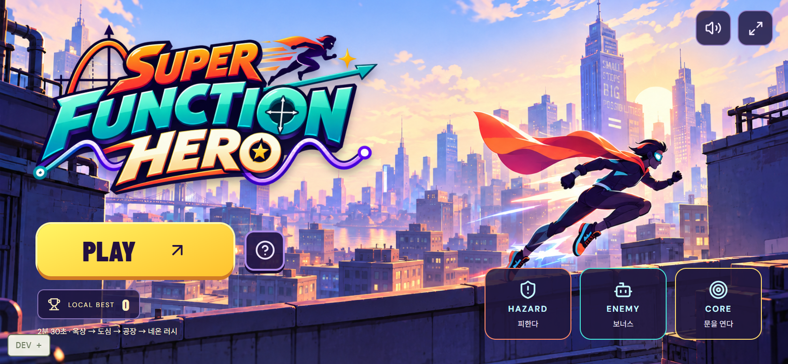

# Super Function Hero · v0.3

함수 그래프 자체가 이동·공격인 모바일 가로 액션게임입니다. 문제나 정답 선택 없이 실제 곡선으로 돌파합니다.



## v0.3 — Continuous Run + 제공 에셋

- **150초(2분 30초), 4개 환경**: ROOFTOP SIGNAL → CITY CIRCUIT → FACTORY BREAK → NEON RUSH.
- 17개의 직접 설계한 패턴 블록. 중간 메뉴·로딩 없이 계속 달립니다. 블록마다 착지·아래 루트 복귀 시간을 확보하고 링크를 별도 namespace로 분리합니다.
- 기본 달리기 속도는 142에서 159.04까지 최대 12% 올라갑니다. 섹션 시작 후 4초에 걸쳐 증가하고, 배경 색은 3초 동안 섞입니다. 기술의 거리·시간은 유지하며 반응 여유를 보정합니다.
- 타이틀·플레이·결과는 같은 가로 프레임입니다. 제공 로고·로봇·드론·CORE·가시·금 간 바닥 PNG를 적용했습니다. 원본 투명도를 보존하고 작은 렌더 캐시로 그립니다.
- **가로 전용, 게임 화면만 표시**: 데스크톱도 화면 전체를 게임으로 사용합니다. 헤더·소개·외부 스킬 카드·설명·푸터를 제거하고 좌우 2+2 버튼을 게임 안에 배치했습니다.
- 세로에서는 회전 안내만 표시하며 시작·키보드·기술·재개를 UI와 엔진 양쪽에서 차단합니다. 플레이 중 세로로 돌리면 진행을 보존해 일시정지하고 예약 입력을 비웁니다. 가로로 돌아온 뒤 직접 재개합니다.
- 타이틀 시안의 고정 버튼·숫자는 배경에서 분리했습니다. PLAY·가이드·최고 점수는 실제 동작과 값입니다. 상점·재화 기능은 없습니다.
- 단일 HTML에도 모든 이미지가 포함됩니다.

## 역할과 조작

| 역할   | 규칙                                                        |
| ------ | ----------------------------------------------------------- |
| HAZARD | 파괴 불가. 가시·천장은 피하기. 닫힌 Gate는 전진을 막음      |
| ENEMY  | 점수·콤보 보너스. 놓쳐도 HP 감소 없이 계속 진행             |
| CORE   | 실제 공격 궤적 또는 강한 착지로 활성화해 연결된 Gate를 열기 |

23개 CORE와 연결된 23개 Gate를 열어야 완주합니다. 금 간 바닥은 공중 급강하 착지로 파괴하고 아래 루트의 보너스 웨이브를 만납니다. 지상 급강하 연타로 강한 충격을 만들 수 없습니다.

| 키  | 기술    | 역할                                  |
| --- | ------- | ------------------------------------- |
| 1   | y=x     | 대시, 전진 관통                       |
| 2   | y=x²    | 어퍼컷, 공중 목표                     |
| 3   | y=−x²   | 빠른 하강, 천장 회피·충격판·바닥 파괴 |
| 4   | y=sin x | 물결, 높이가 다른 적 연속 타격        |

왼쪽 엄지는 x/sin x, 오른쪽은 x²/−x². Enter 시작, Space/Esc 일시정지, R 재시작. 140ms 단일 입력 버퍼와 즉시 pointerdown 입력을 유지합니다. 패턴 사이에 설계상 생기는 짧은 이동 구간 때문에 콤보가 끊기지 않도록 유효 시간을 12초로 조정했습니다. 충돌·놓친 적은 여전히 콤보를 끊습니다.

## 실행

Node.js 22.12+ 또는 24:

```sh
git clone https://github.com/CauchyRiemannEquations/super-function-hero.git
cd super-function-hero
npm ci
npm run dev
```

설치 없이 [PLAY-SUPER-FUNCTION-HERO.html](artifacts/PLAY-SUPER-FUNCTION-HERO.html)을 Download raw file로 저장해 브라우저에서 엽니다. 이미지 포함 약 9MB의 단일 파일입니다. 초기 에셋 준비 후 재시작은 캐시를 사용합니다. 외부 폰트가 없어도 플레이합니다.

```sh
npm test
npm run build
npm run preview
npm run standalone
```

## 구조

React·TypeScript·Vite·Canvas, 120Hz 고정 스텝과 이동 구간 충돌입니다.

- assets.ts / src/assets: 제공 원본, 투명 여백과 캐시 렌더링.
- stage.ts / environment.ts: 150초 코스·섹션·진입/종료 간격·속도·환경 혼합.
- objects.ts / render-objects.ts: 역할, CORE/Gate 연결, 실제 충돌과 에셋.
- engine.ts: 이동·전투·아래 루트·수직 카메라·피드백.
- TitleScreen / RotateScreen / MobileSkills: 실시간 타이틀, 세로 회전 안내와 좌우 2+2 조작.

새 함수·계수·Endless·로그인·서버·온라인 랭킹은 추가하지 않았습니다. 다음 단계는 v0.4 Function Campaign입니다. 실제 휴대폰의 주소창·노치·손가락 가림·오디오·네이티브 fullscreen과 저사양 성능은 별도 확인이 필요합니다.

## 검증

단위 테스트 **17개**, 브라우저 검증 **27개 항목** 통과. 실제 150초 키 입력으로 **HP3 / CORE23 / 열린 Gate23 / 바닥 파괴4 / 최대64콤보** 완주했습니다. 모바일에서는 검증한 전반부를 고정 스텝으로 재현한 뒤, 더 빠른 공장 구간의 상승→급강하→아래 루트→4마리 웨이브를 실제 터치로 확인했습니다.

단일 HTML의 PNG 7개가 src/assets의 파일과 byte-for-byte 일치하고, file://에서 로고·터치·DEV 숨김·이미지 참조 실패가 없음을 확인했습니다. 콘솔/페이지 오류 없음. [검증 결과](docs/verification-v03.json), [공장 급강하](docs/images/v03-landscape-factory-crash.png), [야간 구간](docs/images/v03-section-4.png), [클리어](docs/images/v03-desktop-clear.png)를 참고하세요. 이는 실제 휴대폰의 성능이나 플레이 재미 평가를 대체하지 않습니다.

게임 전용 UI 변경 후 **브라우저 25개 항목**을 추가 확인했습니다. 1440×900 데스크톱, 390×844 세로 차단, 844×390·740×360 가로 버튼, 회전 시 진행 보존·수동 재개·버퍼 비우기, 키보드·게임오버·재시작, 단일 HTML을 확인했습니다. 기존 완주 입력을 고정 스텝으로 재현해 HP3 / CORE23 / Gate23을 재검증했습니다. fullscreen 생명주기 검사는 브라우저 내 시뮬레이션이며 실제 장치 API 검증은 별도입니다. [추가 검증](docs/verification-game-only.json), [데스크톱](docs/images/game-only-desktop-title.png), [세로 안내](docs/images/game-only-portrait-block.png), [가로 플레이](docs/images/game-only-landscape-play.png).

[로드맵](docs/ROADMAP.md) · [에셋과 생성 프롬프트](docs/ASSETS.md) · [현재 구현](docs/IMPLEMENTATION.md) · [다음 확인](docs/NEXT_STEPS.md)
